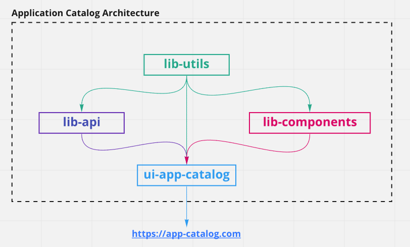

# App Catalog (React)

React app to display application catalog based on https://github.com/giantswarm/fe-hiring-task-api

## Pipeline status:

[](https://github.com/Akash-M/app-catalog/actions/workflows/lib-api-workflow.yaml)
[](https://github.com/Akash-M/app-catalog/actions/workflows/lib-components-workflow.yaml)
[](https://github.com/Akash-M/app-catalog/actions/workflows/lib-utils-workflow.yaml)
[](https://github.com/Akash-M/app-catalog/actions/workflows/ui-app-catalog-workflow.yaml)

## Prerequisites

### Package Manager

This repo is based on Yarn3. Ensure that you have a global installation of
[Yarn3](https://yarnpkg.com/getting-started/install#global-install). Note: The project uses `pnp` to ensure faster
installation of application dependencies in a monorepo setup.

You can test if yarn is installed correctly by using:

```sh
yarn --version
```

### Step 1: Install dependencies:

```sh
yarn
```

### Step 2: Setup the backend app:

Ensure that you have the backend running after checking out the code
from [here](https://github.com/giantswarm/fe-hiring-task-api).

### Step 3: Start the frontend app:

Start `ui-app-catalog` app

```sh
yarn start:frontend
```

### Step 4(Optional): Run storybook to display component library:

Start `lib-components` app

```sh
yarn start:storybook
```

### Further documentation:

Please find the documentation specific to the apps inside the app ReadMe linked in the following section:

- [lib-api](packages/frontend/lib-api/README.md)
- [lib-components](packages/frontend/lib-components/README.md)
- [lib-utils](packages/frontend/lib-utils/README.md)
- [ui-app-catalog](packages/frontend/ui-app-catalog/README.md)

Documentation about application ideation and wireframes for Figma can be found under:

- [app-ideation](app-ideation/README.md)

### Workspace Structure

This application follows a monorepo approach. The following sections explains the folder structure:

- `./.github/`: PR templates and Github Action definitions.
- `./.yarn/`: Dependencies installed from yarn3.
- `./packages/`: TypeScript applications defined as independent modules.
    - `frontend/`: Folder containing the frontend application and related code.
        - `lib-api`: Library of global api calls. Consists of mocked api calls for sake of demo.
        - `lib-components`: Library of global generic components independent of application specific logic.
        - `lib-utils`: Library of global utility files.
        - `types`: Global type definitions for frontend folder.
        - `ui-app-catalog`: The Consents client app which is the final deliverable.
- `./`
    - `.eslintrc.js`: The global ESLint rules.
    - `.gitignore`: File and folder globs to be ignored by git.
    - `.yarnrc.yml`: Config file for yarn3.
    - `package.json`: The node package definition, with packages links and scripts.
    - `yarn.lock`: Auto generated lock file from yarn.
    - `jest.*.js`: Global jest config for testing.
    - `.prettier`: Config containing prettier files.
    - `.pnp.*`: Autogenerated files containing dependency instructions for yarn3 plug and play.
    - `.yarnrc.yml`: File to specify the dependency tree explicitly. Only required for specific packages.
    - `.tsconfig.*`: Global typescript configuration.
    - `webpack.*`: Global webpack configuration.

### Application Architecture:



### Application Screenshots:

Please find the application screenshots [here](/screenshots)
