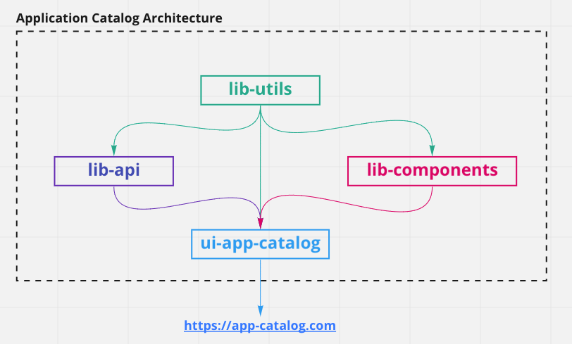

# App ideation

The approach to the development of this repository was done in the following manner:

### Step 1: Ideation of the requirements:

- Figma was used as the tool of choice to setup basic wireframes based on which further development was done.
- The link to the design system can be found here [app-ideation-figma](/app-ideation/app-ideation-design-system.fig)

### Step 2: Setting up the application skeleton:

- The base application skeleton was setup using yarn3. Some advantages of this are as follows:
  - `plug'n'play` modules - speeds up the installation of the application dependencies
  - helps reduce pipeline minutes on Github Actions
  - useful to synchronize versions of the various project wide dependencies
  - the base architecture is captured here: 

### Step 3:

- Implementation of packages in this order:
  - `lib-utils`
  - `lib-api`
  - `lib-components`
  - `ui-app-catalog`
- The order specified helps to avoid circular dependencies between the packages.

### Step 4:

- Implementation of the application designs.

### Step 5:

- Code cleanups and adding documentation.

### Step 6:

- Submission.

### Step 7:

- Presentation and feedback.

## Future Improvements:

Like any software, there is scope for a lot of improvement. If I had to spend more time working on this project,
I would work on the following aspects:

### Features:

Some additional features which would be nice to have in the future:

- add translations for German and allow users to switch language dynamically
- setup theme toggle between light and dark mode
- add more filters in the app-list screen such as sorting by name, author, repos which have urls and readmes.
- implement pagination/lazy loading of components and application list to deal with large payload (Needs updates
  on the backend side as well.
- a default loader component (something like a spinner) should be added as fallback for Suspense when lazy loading
  React components.

### Technical Improvements:

- Create a `backend` folder inside `packages` and migrate the backend project into this repo. Would bring some benefits
  like:
  - sharing types with the backend to ensure more project wide type safety.
  - speeds up local development since all the code is in one place
  - share dependencies between backend and frontend and easier to upgrade common dependencies
- Create custom components in place of using `react-select`. Removing external dependencies helps to manage app bundle
  sizes, allows to customize components based on designs and is also more secure since the dependency trees
  don't grow too much.
- Error handling can be improved especially for cases when api calls fail.

## Note:

If someone has any ideas or feedback, please feel free to create an issue in the github repo and I will be happy to
respond and improve :)
